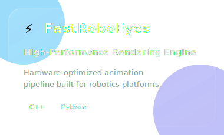
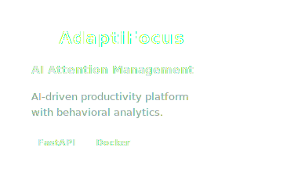
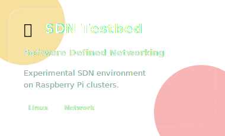

<div align="center">
  
</div>

<div align="center">
  
</div>

<br/>

```yaml
profile:
  name      : Banuka Rajapaksha
  role      : Computer Engineering Undergraduate
  focus     : Scalable Systems · Intelligent Automation · High-Performance Tools
  domains   : [ AI/ML, Distributed Systems, DevOps, Developer Productivity ]
  currently : Building AI productivity tools & distributed full-stack systems
```

<br/>

##  &nbsp; Featured Projects

<table width="100%" border="0" cellspacing="0" cellpadding="0">
<tr valign="top">
<td width="33%" align="center">
<a href="#"></a>
</td>
<td width="33%" align="center">
<a href="#"></a>
</td>
<td width="34%" align="center">
<a href="#"></a>
</td>
</tr>
</table>

<br/>

##  &nbsp; Technology Stack

<div align="center">
  
</div>

<br/>

##  &nbsp; Achievements

<div align="center">

```text
╭─────────────────────────────────────────────────────────────────╮
│                                                                 │
│   🏆  IEEE Xtreme 18.0      →   Global #418  /  17,000+ teams   │
│   🇱🇰  Sri Lanka Rank        →   #22                             │
│   📡  ML Traffic Classifier →   94.3% accuracy                  │
│   ☁️   Cloud CI/CD           →   Fully automated infrastructure  │
│                                                                 │
╰─────────────────────────────────────────────────────────────────╯
```

</div>

<br/>

##  &nbsp; Activity Matrix

<div align="center">


&nbsp;&nbsp;


<br/>


</div>

<br/>

##  &nbsp; Contribution Trail

<div align="center">
  <picture>
    <source media="(prefers-color-scheme: dark)"  srcset="https://raw.githubusercontent.com/PrageethBanuka/PrageethBanuka/output/github-contribution-grid-snake-dark.svg"/>
    <source media="(prefers-color-scheme: light)" srcset="https://raw.githubusercontent.com/PrageethBanuka/PrageethBanuka/output/github-contribution-grid-snake.svg"/>
    
  </picture>
</div>

<br/>

---

<br/>

<div align="center">

[](https://linkedin.com)&nbsp;
[](#)&nbsp;
[](mailto:your@email.com)

<br/>


<br/><br/>

<sub><samp>engineering systems that scale, automate, and think</samp></sub>

</div>
